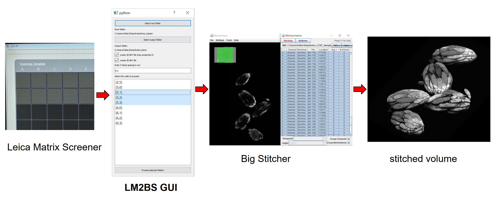

# LM2BS -- Convert Leica Matrix Screener acquistions to Big Stitcher projects

## About

`lm2bs_gui` is a Python app that allows converting microscopy image files acquired with Leica Matrix
Screener to Big Stitcher project, using the meta-data information about the stage position to put each acquired
tile in the correct initial position. (This is a use-case that is not currently handled by the BioFormats
importer in Big Stitcher).

The folder `fiji_batch_scripting` contains some ImageJ/Fiji Jython scripts that perform batch stitching, fusion and export of the generated Big Stitcher projects.

In addition, this repo contains some brief application notes on: 

* how to [set up a tile scan using Leica Matrix Screener](./tile_scan_leica_matrixscreener.md), and
* how to perform [selective high-resolution acquisition](./selective_acquisition/selective_acquisition.md) of fields that show some structure of interest in a low-resoulution pre-scan (using the Leica CAM interface).

## Installation & Start

Create a python environment using `conda` and install dependencies (only needed once.)

* Install anaconda/miniconda
* Start a terminal or cmd window
* Create a new conda environment `conda env create -n lm2bs python=3.6`
* Activate the environment `conda activate lm2bs`
* `conda install -c conda-forge scikit-image pandas tifffile tifffolder pyqt h5py xmltodict`

Startup

* activate the conde environment `conda activate lm2bs`
* in the `lm2bs`  folder execute `python lm2bs_gui.py`

## Usage of LM2BS GUI:

The GUI should be more or less self explanatory.
Proceed with the following steps:

* Select the input folder (this needs to be some level above the `chamber-*` folder level). Once you have selected
the input folder the file structure below will be searched recursively for selective folders. This happens in the background and may take a while. At some point the detected `chambers` will be shown in the list view below.
* Select the output folder. This is where your output Big Stitcher projects will be written. This folder should be empty as `npy2bdv` does not overwrite existing projects.
* 2D checkbox. If you have very large volumes you may want to create a stitching project based on maximum-projections along the Z-axis first. This is typically much faster to stitch and fuse and can give you an overview. The 2D projects will be in a subfolder `projected`.
* 3D checkbox. This creates stitching projects for the full volumes. Those will be created in a subfolder `volume`.
* Enter the Z spacing in micrometers between adjacent Z-slices. In contrast to the X and Y scale this number does not seem to be present in the metdata, therefore you need to take note of it during the experiment and enter the value here.
This is important such that the anisotropy is accounted for in the big data viewer file.
* List view. If the input folder was selected and `chamber-` subfolders were found, you can select one or mutliple  chambers to process there. The indices represent the `--U` and `--V` coordinates of the wells in Matrix Screener.
* After selection, start processing by pressing the button at the bottom.

### Stitching in Big Stitcher

* Start Fiji and install Big Stitcher by activating the Big Stitcher update site.
* Follow the instructions on the Big Stitcher website to stitch one of the generated `.xml` project files. As the big data viewer project files have already been created you can skip the
instructions on importing and start with [opening an existing dataset](https://imagej.net/BigStitcher_Open_existing). 

### Batch Stitching

The folder [./fiji_batch_stitching](../fiji_batch_stitching) contains Fiji scripts that can serve as a 
starting point batch process the stitching, fusion and export as tif for the Big Stitcher projects created
with `lm2bs`. Open them in the Fiji script editor and edit the parameters in the source code.

## Limitations / TODO

* currently only a single channel is supported. Extending this to multiple channels should be straightforward, but I do not have a dataset to test this on
* the code currently assumes that each `field--*` folder only contains images from a single scan job (this can be identified by the `--J` part of the file name). If there is a mixture of different scan jobs (e.g. files with `--J08` and `--J09`) I suspect there will be issues with reading the stacks. This can occur for example if a software autofocus routine is run (for some versions of Matrix Screener the autofocus images are saved in the same folder). The fix in the code (filtering file names based on job number) should be straightforward.
* turn this into a pip installable package

## Acknowledgements

* The sample dataset of drosophila ovarioles was jointly captured with André Nogueira Alves from the [the Mirth lab at Monash University](http://themirthlab.org/) who did the sample preparation. One of the stitched sample volumes is availabe under a [CC-BY license on figshare](https://figshare.com/articles/_/9985568).
* This tool leverages prior efforts by Talley Lambert and Nikita Valdimirov, namely [npy2bdv](https://github.com/nvladimus/npy2bdv) and [tifffolder](https://github.com/tlambert03/tifffolder). npy2bdv is bundled in this repo for easier distribution.
* [Big Stitcher from the Preibisch Lab](https://www.nature.com/articles/s41592-019-0501-0)