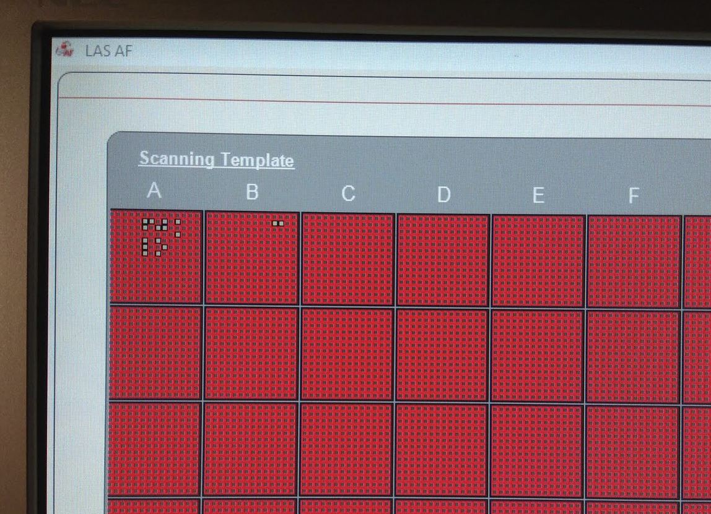

# Selective (smart) acquisition using Leica CAM interface

If the fields to be scanned are only sparsely populated with regions of interest (e.g. cells or drosophila ovarioles as in the example), acquisition time can be saved by performing 2-pass imaging: the first pass is a fast, low-resolution scan. The images
from this scan are then analyzed to find fields that contain the objects of interest and only those fields
are imaged in the slower, high-resolution second pass.

To set up a selective acquisition workflow, follow these steps:

* enable the Leica CAM interface (this is a check box in Matrix Screener). This starts a TCP server on port 8895 of the microscope computer which exposes the Leica CAM interface. Note that due to a bug in some Matrix Screener versions, at least one of scan fields needs to have a scan job assigned for the connection to work.
* define a low-resolution prescan job and assign it to all scan fields. This should be something fast, with just enough resolution and signal/noise ratio to be able to see whether a scan field contains a structure of interest.
* define a high-resolution scan job and test it on a few fields.
* assign the low-resolution scan job to all fields that you want to scan.

Modify the sample python app (TODO) to your needs

* adjust the IP address of the CAM server and the basepath where Leica Matrix Screener saves the output files,
* adjust the name of the high resolution scan job that is assigned,
* write a code snipped that detects whether a structure of interest is present (this could range from something as simple as setting a threshold to a learning-based object detector).

The workflow for the selective acquisition is as follows:

* the matrix screener scan (with the low resolution scanjob) is started (start CAM scan),
* the software waits for the matrix screener scan job to complete,
* all fields are assignes with the high resolution scan job,
* all scanfields are disabled,
* the captured pre-scan images are analysed one by one. If they contain objects of interest, the respective scan field is selectively re-enabled
* once all images have been analyzed a matrix screener scan is started again, this time only in the (re-)enabled scanfields, with the high-resolution acquisition job.

The screenshot below shows such a high-resolution scan in progress. The squares surrounded by red have been disabled and only a few fields have been enabled.

